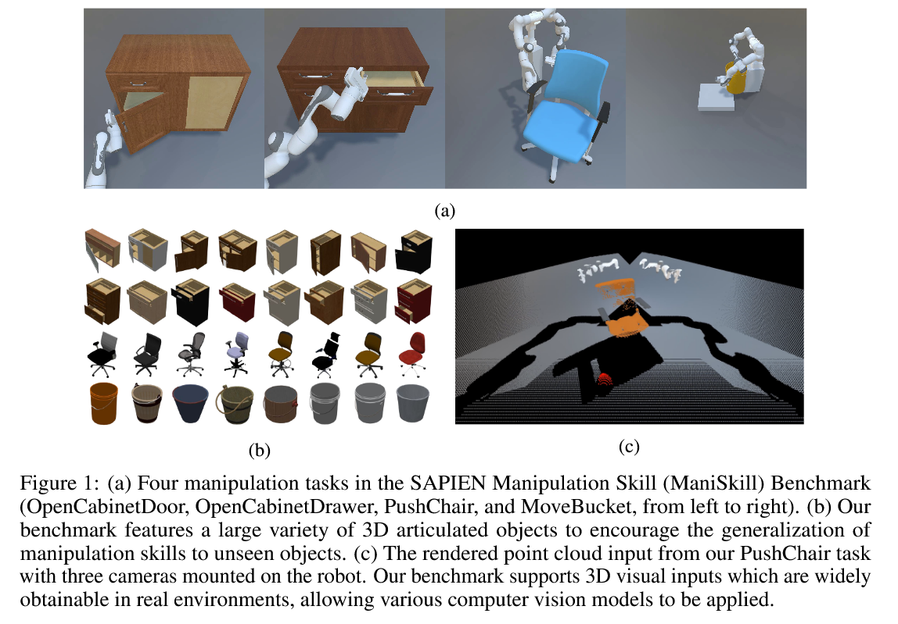
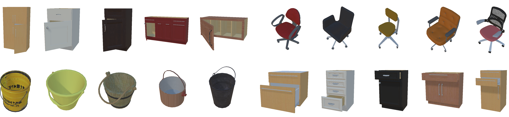
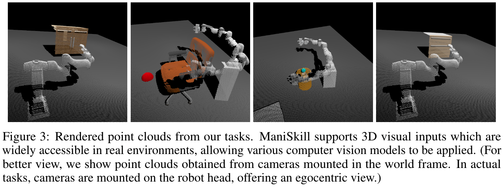

# ManiSkill Benchmark





Object manipulation from 3D visual inputs poses many challenges on building generalizable perception and policy models. However, 3D assets in existing benchmarks mostly lack the diversity of 3D shapes that align with real-world intra-class complexity in topology and geometry. Here we propose SAPIEN **Mani**pulation **Skill** Benchmark (**ManiSkill**) to benchmark manipulation skills over diverse objects in a full-physics simulator. 3D assets in ManiSkill include large intra-class topological and geometric variations. Tasks are carefully chosen to cover distinct types of manipulation challenges. Latest progress in 3D vision also makes us believe that we should customize the benchmark so that the challenge is inviting to researchers working on 3D deep learning. To this end, we simulate a moving panoramic camera that returns ego-centric point clouds or RGB-D images. In addition, we would like ManiSkill to serve a broad set of researchers interested in manipulation research. Besides supporting the learning of policies from interactions,  we also support learning-from-demonstrations (LfD) methods, by providing a large number of high-quality demonstrations (~36,000 successful trajectories, ~1.5M point cloud/RGB-D frames in total). We provide baselines using 3D deep learning and LfD algorithms. All code of our benchmark (simulator, environment, SDK, and baselines) is open-sourced.

Currently, ManiSkill has released 4 different tasks: OpenCabinetDoor, OpenCabinetDrawer, PushChair, and MoveBucket, with 162 objects.

[Click here for our paper.](https://arxiv.org/abs/2107.14483)

[Click here for SAPIEN Open-Source Manipulation Skill Challenge (ManiSkill Challenge) website.](https://sapien.ucsd.edu/challenges/maniskill2021)

This README describes how to install ManiSkill, how to run a basic example, and relevant environment details.

**Table of Contents:**
- [ManiSkill Benchmark](#maniskill-benchmark)
  - [Updates and Announcements](#updates-and-announcements)
  - [Preliminary Knowledge](#preliminary-knowledge)
  - [What Can I Do with ManiSkill? (TL;DR)](#what-can-i-do-with-maniskill-tldr)
    - [For Computer Vision People](#for-computer-vision-people)
    - [For Reinforcement Learning People](#for-reinforcement-learning-people)
    - [For Robot Learning People](#for-robot-learning-people)
  - [Getting Started](#getting-started)
    - [System Requirements](#system-requirements)
    - [Installation](#installation)
    - [Basic Example](#basic-example)
    - [Viewer Tutorial](#viewer-tutorial)
    - [Utilize Demonstrations](#utilize-demonstrations)
    - [Baselines and Training Framework](#baselines-and-training-framework)
    - [FAQ](#faq)
  - [Environment Details](#environment-details)
    - [Tasks](#tasks)
    - [Robots and Actions](#robots-and-actions)
    - [Observations](#observations)
      - [Observation Structure for Each Mode](#observation-structure-for-each-mode)
      - [Segmentation Masks](#segmentation-masks)
    - [Rewards](#rewards)
    - [Termination](#termination)
    - [Evaluation](#evaluation)
    - [Visualization](#visualization)
    - [Available Environments](#available-environments)
  - [Advanced Usage](#advanced-usage)
    - [Custom Split](#custom-split)
    - [Visualization inside Docker](#visualization-inside-docker)
    - [Operational Space Control](#operational-space-control)
    - [Get Pose of End Effector](#get-pose-of-end-effector)
  - [Conclusion](#conclusion)
  - [Acknowledgements](#acknowledgements)
  - [Citation](#citation)


## Updates and Announcements
- Feb 16, 2022: We launched a [temporary test server](https://sapien.ucsd.edu/challenges/maniskill2021test/) to provide test set evaluation service.
- Nov 15, 2021: We provided a detailed explanation of the action space, see [here](https://github.com/haosulab/ManiSkill/wiki/Detailed-Explanation-of-Action).
- Nov 6, 2021: We provided a more detailed explanation of the observations, see [here](https://github.com/haosulab/ManiSkill/wiki/Detailed-Explanation-of-The-Agent-State-Vector).
- Oct 11, 2021: ManiSkill has been accepted to **NeurIPS 2021 Track on Datasets and Benchmarks**!
- Sep 5, 2021: The treatment of background points in observations are slightly different in the demonstration data and our old environments. We have changed the environments so that the background treatment matches exactly. Please pull the latest codes from the ManiSkill repo and rerun the evaluation scripts to measure performance. You do not need to update the demonstration data or retrain an existing model if it has been trained solely on our demonstration data (but you need to re-evaluate the model).
- Aug 16, 2021: ManiSkill now supports operational space control.
- July 29, 2021: The initial version of ManiSkill is released!

## Preliminary Knowledge
ManiSkill environment is built on the [gym](https://gym.openai.com/docs/) interface. 
If you have used OpenAI gym or have worked on RL previously, you can skip this section.

In ManiSkill environments, you are controlling a robot to accomplish certain predefined tasks in simulated environments. 
The tasks are defined by rewards.
Every timestep you are given an observation (e.g., point cloud / image) from the environment, and you are required to output an action (a vector) to control the robot.

 (* image credits to OpenAI Gym)

Explanations about the above terminologies: 
- Observation: a description about the current state of the simulated environment, which may not contain complete information. Observation is usually represented by several arrays (e.g., point clouds, images, vectors).
- Action: how an agent interacts with the environment, which is usually represented by a vector.
- Reward: used to define the goal of an agent, which is usually represented by a scalar value.

## What Can I Do with ManiSkill? (TL;DR)

### For Computer Vision People
Based on the current visual observations (point clouds / RGBD images), your job is to output an action (a vector).
We provide supervision for actions, so training an agent is just supervised learning (more specifically, imitation learning).
You can start with little knowledge on robotics and policy learning.

### For Reinforcement Learning People
ManiSkill is designed for the generalization of policies and learning-from-demonstrations methods.
Some topics you might be interested:
- how to combine offline RL and online RL
- generalize a manipulation policy to unseen objects
- ...

### For Robot Learning People
In simulated environments, large-scale learning and planning are feasible.
We provide four meaningful daily-life tasks for you as a good test bed.

## Getting Started
This section introduces benchmark installation, basic examples, demonstrations,
and baselines we provide.

### System Requirements
Minimum requirements
- Ubuntu 18.04 / Ubuntu 20.04 or equivalent Linux distribution. 16.04 is **not** supported.
- Nvidia GPU with > 6G memory
- Nvidia Graphics Driver 460+ (lower versions may work but are untested)

### Installation
First, clone this repository and `cd` into it.
```
git clone https://github.com/haosulab/ManiSkill.git
cd ManiSkill
```

Second, install dependencies listed in `environment.yml`. 
It is recommended to use the latest (mini)[conda](https://docs.conda.io/en/latest/miniconda.html#linux-installers) to manage the environment, but you can also choose to manually install the dependencies.
```
conda env create -f environment.yml
conda activate mani_skill
```

Lastly, install ManiSkill.
```
pip install -e .
```

### Basic Example
Here is a basic example for making an environment in ManiSkill and running a random policy in it. You can also run the full script using `basic_example.py`. 
ManiSkill environment is built on the [OpenAI Gym](https://gym.openai.com/docs/) interface. If you have not used OpenAI Gym
before, we strongly recommend reading their documentation first.

```python
import gym
import mani_skill.env

env = gym.make('OpenCabinetDoor-v0')
# full environment list can be found in available_environments.txt

env.set_env_mode(obs_mode='state', reward_type='sparse')
# obs_mode can be 'state', 'pointcloud' or 'rgbd'
# reward_type can be 'sparse' or 'dense'
print(env.observation_space) # this shows the observation structure in Openai Gym's format
print(env.action_space) # this shows the action space in Openai Gym's format

for level_idx in range(0, 5): # level_idx is a random seed
    obs = env.reset(level=level_idx)
    print('#### Level {:d}'.format(level_idx))
    for i_step in range(100000):
        # env.render('human') # a display is required to use this function; note that rendering will slow down the running speed
        action = env.action_space.sample()
        obs, reward, done, info = env.step(action) # take a random action
        print('{:d}: reward {:.4f}, done {}'.format(i_step, reward, done))
        if done:
            break
env.close()

```
### Viewer Tutorial
The `env.render('human')` line above opens the SAPIEN viewer for interactively
debugging the environment. Here is a short tutorial.

Navigation:
- Use `wasd` keys to move around (just like in FPS games).
- Hold `Right Mouse Button` to rotate the view.
- Click on any object to select it. Now press `f` to enter the focus mode. In the focus
  mode, hold `Right Mouse Button` to rotate around the object origin. Use `wasd`
  to exit the focus mode.
- **Important limitation: do not reset a level while an object is selected,
  otherwise the program will crash.**

Inspection:
- `Pause` will keep the rendering running in a loop and pause the simulation. You can
  look around with the navigation keys when paused.
- You can use the Scene Hierarchy tool to select objects.
- Use the Actor/Entity tab and the Articulation tab to view the properties of the selected
  object.

You can find a more detailed tutorial
[here](https://sapien.ucsd.edu/docs/latest/tutorial/basic/viewer.html).

### Utilize Demonstrations
We provide demonstration datasets for each task to facilitate learning-from-demonstrations approaches.
Please refer to the documentation [here](https://github.com/haosulab/ManiSkill-Learn#demonstrations).

### Baselines and Training Framework
We provide a high-quality framework for training agents on the ManiSkill Benchmark at [ManiSkill-Learn](https://github.com/haosulab/ManiSkill-Learn). The framework supports various imitation learning and offline-RL baselines implemented using point-cloud based network architectures. Try it out!

In our challenge, ManiSkill (this repo) contains the environments you need to work on, 
and [ManiSkill-Learn](https://github.com/haosulab/ManiSkill-Learn) framework contains the baselines provided by us. 
ManiSkill is a required component for this challenge, but ManiSkill-Learn is not required.
However, we encourage you to use ManiSkill-Learn to develop your algorithms and it will help you start quicklier and easier.

### FAQ
FAQ page is hosted [here](https://github.com/haosulab/ManiSkill/wiki).

## Environment Details
This section describes some details of the environments in the
ManiSkill Benchmark. ManiSkill environments are built on the
[Gym](https://gym.openai.com/docs/) interface. If you have not used OpenAI Gym
before, we strongly recommend reading their documentation first.

### Tasks
ManiSkill Benchmark currently contains 4 tasks: `OpenCabinetDoor`, `OpenCabinetDrawer`,
`PushChair`, and `MoveBucket`.

`OpenCabinetDoor` and `OpenCabinetDrawer` are examples of manipulating
articulated objects with revolute and prismatic joints respectively. The agent
is required to open the target door or drawer through the coordination between
arm and body.

`PushChair` exemplifies the ability to manipulate complex underactuated systems.
The agent needs to push a swivel chair to a target location. Each chair is
typically equipped with several omni-directional wheels and a rotating seat.

`MoveBucket` is an example of manipulation that heavily relies on two-arm
coordination. The agent is required to lift a bucket with a ball in it from the
ground onto a platform.

These environments can be constructed by changing the environment name passed to
`gym.make`. Keep reading for more details.

### Robots and Actions
The state of the robot is a vector, and the action is also a vector. We have implemented modules compiling the state of the robot into a vector, and modules converting the action vector into the robot control signals. 
While you do not need to worry about them, the details are provided below in case of you are curious.
All the tasks in ManiSkill use similar robots, which are composed of three parts: moving platform, Sciurus robot body, and one or two Franka Panda arm(s). The moving platform can move and rotate on the ground plane, and its height is also adjustable. The robot body is fixed on top of the platform, providing support for the arms. Depending on the task, one or two robot arm(s) are connected to the robot body. There are 22 joints in the dual-arm robot and 13 for the single-arm robot.
To match with the realistic robotics setup, we use PID controllers to control the joints of the robots. The robot fingers use position controllers, while all other joints, including the moving platform joints and the arm joints, use velocity controllers. The controllers are internally implemented as augmented PD and PID controllers. The action space corresponds to the normalized target values of all controllers. A detailed exaplanation of the action space can be found [here](https://github.com/haosulab/ManiSkill/wiki/Detailed-Explanation-of-Action).

We also provide another action interface based on operational space control, please see [Operational Space Control](#operational-space-control) for more details.


### Observations
ManiSkill supports three observation modes: `state`, `pointcloud` and `rgbd`, which can be set by `env.set_env_mode(obs_mode=obs_mode)`.
For all observation modes, the observation consist of three components: 1) A vector that describes the current state of the robot, including pose, velocity, angular velocity of the moving platform of the robot, joint angles and joint velocities of all robot joints, as well as states of all controllers; 2) A vector that describes task-relevant information, if necessary; 3) Perception of the scene, which has different representations according to the observation modes. In `state` mode, the perception information is a vector that encodes the full ground truth physical state of the environment (e.g. pose of the manipulated objects); in `pointcloud` mode, the perception information is a point cloud captured from the mounted cameras on the robot; in `rgbd` mode, the perception information is RGB-D images captured from the cameras.

#### Observation Structure for Each Mode

The following script shows the structure of the observations in different observation modes.
```python
# Observation structure for pointcloud mode
obs = {
    'agent': ... , # a vector that describes the agent's state, including pose, velocity, angular velocity of the 
                   # moving platform of the robot, joint angles and joint velocities of all robot joints, 
                   # positions and velocities of the robot fingers
    'pointcloud': {
        'rgb': ... , # (N, 3) array, RGB values for each point
        'xyz': ... , # (N, 3) array, position for each point, recorded in the world frame
        'seg': ... , # (N, k) array, k task-relevant segmentation masks, e.g. handle of a cabinet door, each mask is a binary array
    }
}

# Observation structure for rgbd mode
obs = {
    'agent': ... , # a vector that describes agent's state, including pose, velocity, angular velocity of the 
                   # moving platform of the robot, joint angles and joint velocities of all robot joints, 
                   # positions and velocities of the robot fingers
    'rgbd': {
        'rgb': ... , # (160, 400, 3*3) array, three RGB images concatenated on the last dimension, captured by three cameras on robot
        'depth': ... , # (160, 400, 3) array, three depth images concatenated on the last dimension
        'seg': ... , # (160, 400, k*3) array, k task-relevant segmentation masks, e.g. handle of a cabinet door, each mask is a binary array
    }
}

# Observation structure for state mode
obs = ... # a vector that describes agent's state, task-relevant information, and object-relevant information; 
          # the object-relevant information includes pose, velocity, angular velocity of the object, 
          # as well as joint angles and joint velocities if it is an articulated object (e.g, cabinet). 
# State mode is commonly used when training and test on the same object, 
# but is not suitable for studying the generalization to unseen objects, 
# as different objects may have completely different state representations. 

```
A detailed explanation of the `agent` vector can be found [here](https://github.com/haosulab/ManiSkill/wiki/Detailed-Explanation-of-The-Agent-State-Vector).


The observations `obs` are typically obtained when resetting and stepping the environment as shown below
```python
# reset
obs = env.reset(level=level_idx)

# step
obs, reward, done, info = env.step(action)
```

#### Segmentation Masks
As mentioned in the codes above, we provide task-relevant segmentation masks in `pointcloud` and `rgbd` modes.
Here are the details about our segmentation masks for each task:
- `OpenCabinetDoor`: handle of the target door, target door, robot (3 masks in total)
- `OpenCabinetDrawer`: handle of the target drawer, target drawer, robot (3 masks in total)
- `PushChair`: robot (1 mask in total)
- `MoveBucket`: robot (1 mask in total)

Basically, we provide the robot mask and any mask that is necessary for specifying the target. For example, in OpenCabinetDoor/Drawer environments, a cabinet might have many doors/drawers, so we provide the door/drawer mask such that users know which door/drawer to open. We also provide handle mask such that the users know from which direction the door/drawer should be opened.

### Rewards
The reward for the next step can be obtained by `obs, reward, done, info = env.step(action)`. 
ManiSkill supports two kinds of rewards: `sparse` and `dense`. The sparse reward is a binary signal which is equivalent to the task-specific success condition. Learning with sparse reward is very difficult. To alleviate such difficulty, we carefully designed well-shaped dense reward functions for each task. The type of reward can be configured by `env.set_env_mode(reward_type=reward_type)`.

### Termination
The agent-environment interaction process is composed of subsequences, each containing a starting point and an ending point, which we call episodes. Examples include plays of a game and trips through a maze. 

In ManiSkill tasks, an episode will be terminated if either of the following conditions is satisfied:
- Go beyond the time limit
  - In all tasks, the time limit for each episode is 200, which should be sufficient to solve the task.
- Task is solved
  - We design several success metrics for each task, which can be accessed from `info['eval_info']`.
  - Each metric will be `True` if and only if some certain conditions are satisfied for 10 consecutive steps.
  - The task is regarded as solved when all the metrics are `True` at the same time.

### Evaluation
We evaluate the performance of a policy (agent) on each task by the **mean success rate**.
A formal description of the challenge submission and evaluation processes can be found [here](https://github.com/haosulab/ManiSkill-Submission-Example). 

Users can also evaluate their policies using the evaluation tools provided by us.
Please go through the following steps:

- Implement your solution following [this example](https://github.com/haosulab/ManiSkill-Submission-Example)
  - If your codes include file paths, please use the relative paths with respect to your code file. (Check [this example](https://stackoverflow.com/questions/10174211/how-to-make-an-always-relative-to-current-module-file-path))
- Name your solution file `user_solution.py`
- Run `PYTHONPATH=YOUR_SOLUTION_DIRECTORY:$PYTHONPATH python mani_skill/tools/evaluate_policy.py --env ENV_NAME`
    - `YOUR_SOLUTION_DIRECTORY` is the directory containing your `user_solution.py`
    - Specify the levels on which you want to evaluate: `--level-range 100-200`
    - Note that you should active a python environment supporting your `user_solution.py` before running the script
- Result will be exported to `./eval_results.csv`


### Visualization
The environment normally runs in off-screen mode. If you want to visualize the
scene in a window and interactively inspect the scene, you need to call 

```python
env.render("human")
```

This function requires your machine to be connected to a display screen, or more
specifically, a running x-server. It opens a visualization window that you can
interact with. Do note that using this visualization can add additional helper
objects or change the appearance of objects in the scene, so you should **NOT**
generate any data for training purposes while the visualizer is open.

The visualizer is based on the SAPIEN viewer, and it provides a lot of debugging
functionalities. You can read more about how to use this viewer
[here](https://sapien.ucsd.edu/docs/latest/tutorial/basic/viewer.html). **Note:
the render function must be called repeatedly to interact with the viewer, and
the viewer will not run by itself when the program is paused.**


### Available Environments
We registered three kinds of environments:
1. Random-object environment
  - If you call `env.reset()`, you may get a different object instance (e.g., a different chair in PushChair task).
  - Environment names: `OpenCabinetDoor-v0`, `OpenCabinetDrawer-v0`, `PushChair-v0`, and `MoveBucket-v0`.
2. Fixed-object environment
  - Only one object instance will be presented in the environment, and it will never be replaced by other object instances.
  - These environments are registered as simpler versions of the multi-object environments, and they can be used for debugging.
  - Environment name examples: `PushChair_3000-v0`, `OpenCabinetDoor_1000-v0`, ... .
3. Fixed-link environment
  - Only OpenCabinetDoor and OpenCabinetDrawer have fixed-link environments, since a cabinet can have multiple target links (door or drawer).
  - In a fixed-link environment, the target link (door or drawer) to be opened is fixed, and it will not change by calling `env.reset()`.
  - Environment name examples: `OpenCabinetDoor_1000_link_0-v0`


The full list of available environments can be found in `available_environments.txt`. 


## Advanced Usage
### Custom Split
If you want to select some objects to be used in a task (e.g., create training/validation split), we provide an example for you.
Let us take the PushChair task as an example. You can create a file such as `mani_skill/assets/config_files/chair_models_custom_split_example.yml` to specify the objects you want to use. You also need to modify [these lines](https://github.com/haosulab/ManiSkill/blob/main/mani_skill/env/__init__.py#L110-L118) accordingly to register new environments.

### Visualization inside Docker
If you want to visualize the environment while running in a Docker, you should give the Docker container access to the graphics card and let
the Docker container access your local x-server. When starting the Docker, make
sure to pass `--gpus all -e DISPLAY=$DISPLAY -e QT_X11_NO_MITSHM=1 -e XAUTHORITY
-e NVIDIA_DRIVER_CAPABILITIES=all -v /tmp/.X11-unix:/tmp/.X11-unix` as
arguments. For example,
```bash
docker run -i -d --gpus all --name maniskill_container  \
  -e DISPLAY=$DISPLAY -e QT_X11_NO_MITSHM=1 -e XAUTHORITY -e NVIDIA_DRIVER_CAPABILITIES=all -v /tmp/.X11-unix:/tmp/.X11-unix  \
  DOCKER_IMAGE_NAME
```
Next, connect the x-server by
```bash
xhost +local:`docker inspect --format='{{ .Config.Hostname }}' maniskill_container`
```
You can replace the `maniskill_container` with your container name.

### Operational Space Control
The action passed into `env.step()` is a control signal in the joint space. In addition, we provide another action interface based on operational space control. 
In `maniskill/utils/osc.py`, we implement a class `OperationalSpaceControlInterface`, which is used to convert actions 
between the joint space and the operational space. We also provide some basic examples.

`OperationalSpaceControlInterface` takes the name of a task as input, which is used to determine the type of robot and its related information. It provides two functions (`joint_space_to_operational_space_and_null_space` and `operational_space_and_null_space_to_joint_space`) to map between actions in the joint space and actions in the operational space and the null space. 

The operational space of our robot contain three parts: the joints of the moving platform (4 dimensions: translation (x, y, z) and rotation about z), the joints of the robot fingers (2 * num_of_arms), and the 6D velocities of end effectors in their local (i.e. end effectors') frames (6 * num_of_arms). To be more specific, the 6D velocity of end effector is a body twist at the end effector origin frame ordered as `[v omega]`.

The null space contains 7 * num_of_arms degrees of freedom. An action in the null space (i.e. whose operational space component is a zero vector) provides movements in the null space of end effectors, which means that it **only moves the links on the robot arm(s)** but keeps the end effector (link `left_panda_hand` or `right_panda_hand`) static.

We also provide some basic examples in the `test()` function of `maniskill/utils/osc.py`. Please check it for further understanding.

### Get Pose of End Effector
If you want to manually design some controllers, then the pose(s) of the end effector(s) might be needed. 
We provided an [example](https://github.com/haosulab/ManiSkill/blob/main/mani_skill/utils/ee.py) to compute the pose(s) of the end effector(s) in the world frame from the observation dict. 
Specifically, the poses of the end effectors refer to the poses of `right_panda_hand` / `left_panda_hand` links in our robot.

## Conclusion
Now that you have familiarized yourself with the ManiSkill benchmark, you can
train and visualize policies on the ManiSkill environments. You may want to play with [our baselines](https://github.com/haosulab/ManiSkill-Learn) 
and get started with learning-from-demonstrations algorithms. 

## Acknowledgements
We thank Qualcomm for sponsoring the associated challenge, Sergey Levine and Ashvin Nair for insightful discussions during the whole development process, Yuzhe Qin for the suggestions on building robots, Jiayuan Gu for providing technical support on SAPIEN, and Rui Chen, Songfang Han, Wei Jiang for testing our system.

## Citation
```
@inproceedings{mu2021maniskill,
  title={ManiSkill: Generalizable Manipulation Skill Benchmark with Large-Scale Demonstrations},
  author={Mu, Tongzhou and Ling, Zhan and Xiang, Fanbo and Yang, Derek Cathera and Li, Xuanlin and Tao, Stone and Huang, Zhiao and Jia, Zhiwei and Su, Hao},
  booktitle={Thirty-fifth Conference on Neural Information Processing Systems Datasets and Benchmarks Track (Round 2)},
  year={2021}
}
```
